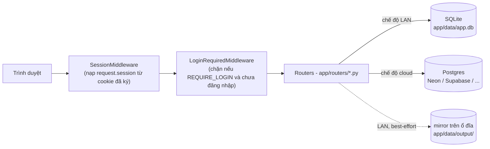
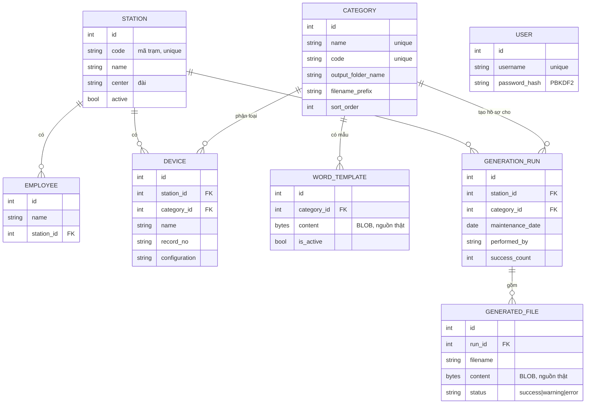

# Kiến trúc hệ thống

Tài liệu kỹ thuật chi tiết cho `ProjectBDTB_New`. Xem `README.md` để biết cách cài đặt/sử dụng, và
`CLAUDE.md` cho hướng dẫn ngắn gọn khi làm việc với Claude Code. Tài liệu này đi sâu hơn vào *cách* hệ
thống được xây dựng và *tại sao*.

## Tổng quan

FastAPI (Python) + SQLAlchemy 2.0 + Jinja2 + JS/CSS thuần (không framework, không build step). Một
codebase, hai chế độ triển khai được chọn tự động lúc khởi động dựa trên biến môi trường:

| | Chế độ LAN (mặc định) | Chế độ Cloud (Vercel...) |
|---|---|---|
| Kích hoạt bằng | Không có `DATABASE_URL`/`POSTGRES_URL`/`POSTGRES_PRISMA_URL` | Một trong các biến trên được set |
| Database | SQLite file `app/data/app.db` | Postgres (qua `psycopg[binary]`) |
| Đăng nhập | Không (`REQUIRE_LOGIN = False`) | Bắt buộc (`REQUIRE_LOGIN = True`) |
| Cookie session | `https_only=False` | `https_only=True` |
| Filesystem cục bộ | Có, ghi thật (mirror file .docx, output folder) | Không có (read-only/ephemeral) — mọi ghi đĩa bị bỏ qua có kiểm soát |
| Auto-seed từ `ProjectBDTB_Old` | Có (chỉ khi DB rỗng) | Không (`_auto_seed_from_legacy_project` return sớm) |
| Migration schema (`migrations.py`) | Chạy (`ALTER TABLE`) | Không cần (DB mới luôn tạo đúng schema hiện tại qua `init_db()`) |
| Khởi chạy | `run.bat` → uvicorn trên `127.0.0.1:8899` | `api/index.py` làm entrypoint serverless, cấu hình ở `vercel.json` |

Cờ duy nhất mọi nơi dựa vào là `database.IS_SQLITE`, suy ra tại import time trong `database.py` và được
các module khác import lại (`auth.REQUIRE_LOGIN = not IS_SQLITE`, v.v.) — không có cờ cấu hình thứ hai nào
khác cần đồng bộ.

## Mô hình dữ liệu

`USER` và `AppSetting` (key-value đơn giản, chỉ có `output_root` hiện tại) không có quan hệ FK với phần
còn lại. `Station`/`Category` **không** bị xoá tự động khi nhập Excel vì `GenerationRun` tham chiếu chúng —
xoá một trạm/mục đang có lịch sử sẽ bị chặn ở tầng DB (`IntegrityError`, bắt lại thành thông báo lỗi thân
thiện, xem `routers/stations.py:delete_station` và `routers/categories.py:delete_category`). `Employee` và
`Device` không bị ai tham chiếu bằng FK nên bị xoá thẳng tay cả khi nhập Excel lẫn khi người dùng bấm xoá.

## Luồng chính: Tạo hồ sơ bảo dưỡng

`routers/generate.py`, trang mặc định (`/`) redirect sang `/generate`).

1. Trang tải danh sách trạm đang `active` để đổ vào `<select>` đầu tiên.
2. JS phía client gọi 3 API phụ thuộc lẫn nhau theo tầng, mỗi tầng đợi tầng trước:
   `GET /api/generate/categories?station_id=` → chỉ trả về mục bảo dưỡng nào trạm đó **thực sự có thiết
   bị** (join với `Device`), kèm cờ `has_template` để JS có thể cảnh báo trước khi submit thay vì để
   submit thất bại.
   `GET /api/generate/employees?station_id=` → nhân viên của trạm, cho ô Người thực hiện/Người phối hợp.
   `GET /api/generate/devices?station_id=&category_id=` → danh sách thiết bị để tick chọn (mặc định tick
   hết).
3. Submit thật là `POST /api/generate/run`, body là `schemas.GenerateRequest` (Pydantic, FastAPI tự
   validate/deserialize JSON). Server-side validate lại toàn bộ (trạm/mục tồn tại, người thực hiện ≠
   người phối hợp, mục đã có template active chưa, thiết bị chọn có thật sự thuộc trạm+mục đó không) —
   không tin dữ liệu từ client dù JS đã lọc.
4. Với **mỗi thiết bị đã chọn**: build `mapping` dict (12 khoá tương ứng 12 thẻ `[[...]]`) → gọi
   `docx_engine.generate_one()` → nhận `GenerateResult` (bytes nội dung + trạng thái) → lưu thành 1 dòng
   `GeneratedFile` (dù thành công/cảnh báo/lỗi — lỗi cũng được ghi lại để người dùng thấy trong lịch sử,
   không bị nuốt).
5. Một `GenerationRun` bọc ngoài cả lượt (đếm success/warning/error), là đơn vị mà trang **Lịch sử** hiển
   thị và cho tải ZIP/xoá theo lượt.
6. `output_dir` chỉ khác `None` ở chế độ SQLite (`IS_SQLITE`) — chế độ cloud luôn truyền `None`, khiến
   `docx_engine.generate_one()` bỏ qua hoàn toàn bước ghi đĩa và chỉ trả bytes.

## Bộ máy điền mẫu Word (`docx_engine.py`)

Vấn đề cốt lõi: Word hay tách một thẻ hiển thị liền mạch như `[[thietbi]]` thành **nhiều `<w:r>` run**
trong XML (do spell-check, autocorrect, hoặc chỉnh sửa định dạng giữa chừng) — thay per-run string
`.replace()` ngây thơ sẽ âm thầm bỏ sót thẻ mà không báo lỗi gì.

Cách xử lý (`replace_placeholders_in_paragraph`): với mỗi đoạn văn (paragraph), ghép text của **toàn bộ**
run lại thành một chuỗi, tìm thẻ `[[key]]` trên chuỗi đã ghép đó bằng regex, rồi tính xem thẻ đó "trải" qua
những run vật lý nào (`_iter_run_spans`). Ghi giá trị mới vào run đầu tiên trong khoảng đó, giữ phần text
trước/sau thẻ ở đúng run đầu/cuối, và làm rỗng các run ở giữa — đúng hành vi mà Find/Replace của Word thể
hiện ra màn hình. Lặp lại (tối đa 200 lần/đoạn, để chặn vòng lặp vô hạn nếu logic có lỗi) cho tới khi không
còn thẻ nào khớp `mapping`. Thẻ không nằm trong `mapping` bị bỏ qua nguyên văn thay vì crash — tương thích
ngược với template cũ có thể chứa thẻ mà bản build hiện tại chưa biết tới.

`_iter_all_paragraphs` duyệt cả đoạn văn thường, đoạn trong bảng (kể cả bảng lồng bảng), và trong
header/footer (kể cả trang đầu riêng) — các thẻ trong file mẫu cũ nằm rải rác ở tất cả các vị trí này.

## Lỗi crash tên dài — cơ chế sửa (`docx_engine.py`)

Công cụ VBA cũ gọi thẳng Windows API để lưu file; khi đường dẫn (`<thư mục gốc>\<mục>\<tên file>`) vượt 260
ký tự (`MAX_PATH`), `Word.SaveAs` báo lỗi/crash. Bản mới xử lý 3 lớp, độc lập với việc người dùng đặt thư
mục gốc dài hay ngắn:

1. **`long_path()`**: mọi thao tác ghi đĩa (chỉ có ở chế độ LAN) đi qua tiền tố mở rộng `\\?\` của Windows,
   nâng giới hạn lên khoảng 32.000 ký tự thay vì 260.
2. **`shorten_component()`**: tên thiết bị dùng trong tên file bị rút gọn nếu vượt `MAX_COMPONENT_LEN`
   (80 ký tự), giữ phần đầu + 6 ký tự băm SHA-1 để tránh trùng tên sau khi rút gọn, kèm cảnh báo hiển thị
   cho người dùng thay vì lỗi câm lặng.
3. Trang **Cài đặt** cho đổi thư mục gốc lưu file (chỉ có ý nghĩa ở chế độ LAN — `settings.html` ẩn phần
   này ở chế độ cloud, xem `is_sqlite` truyền vào template).

Điểm mấu chốt khiến lớp 1 *luôn* đủ để hết crash, bất kể lớp 2/3: nội dung file luôn được lưu vào cột BLOB
trong database trước (không bao giờ thất bại vì lý do đường dẫn); việc ghi đĩa ở chế độ LAN chỉ là mirror
"best-effort" — thất bại (bắt bằng `except Exception: pass` trong `generate_one()`) không làm hỏng request.

## Vì sao nội dung file nằm trong database, không nằm trên đĩa

Đây là thay đổi kiến trúc lớn nhất so với bản thiết kế LAN-only ban đầu, bắt nguồn trực tiếp từ lần đầu
deploy lên Vercel bị crash: serverless function không có ổ đĩa ghi được lâu dài giữa các request (mỗi lần
gọi có thể chạy trên một container hoàn toàn mới). Giải pháp: `WordTemplate.content` và
`GeneratedFile.content` (cột `LargeBinary`) là **nguồn thật duy nhất** ở mọi chế độ — mọi endpoint tải
xuống (`routers/history.py`) đọc từ cột này, không đọc từ đĩa.

Ở chế độ LAN, `docx_engine.generate_one()` *thêm* một bản ghi ra `app/data/output/<mục>/` chỉ để nút "Mở
thư mục" có gì đó để mở bằng Explorer — hoàn toàn là tiện ích phụ, không phải một cơ chế lưu trữ song song
đáng tin cậy. `GeneratedFile.full_path` vẫn được lưu ở mọi chế độ nhưng ở chế độ cloud nó chỉ là chuỗi mô
tả, không trỏ tới file thật nào.

`app/paths.py` tạo thư mục `DATA_DIR`/`DEFAULT_OUTPUT_DIR` bằng `mkdir()` bọc trong `try/except OSError:
pass` — nếu không bọc, riêng việc `import app.paths` trên filesystem read-only của Vercel đã đủ làm sập
toàn bộ ứng dụng trước khi kịp chạy dòng code nào khác (đây chính xác là lỗi 500 đầu tiên gặp phải khi
deploy).

## Nhập/Xuất Excel — ngữ nghĩa đồng bộ hai chiều (`excel_import.py` / `excel_export.py`)

Xuất và Nhập dùng chung đúng 1 layout 4 sheet (`tram`, `nhan vien`, `muc`, `thiet bi`) — vòng lặp bình
thường là **Xuất → sửa trong Excel → Nhập lại chính file đó**, không phải là cơ chế nhập một lần rồi bỏ.

Quy tắc quan trọng nhất — **"sheet là danh sách đầy đủ cho phạm vi nó bao phủ"**: với `thiet bi`, mỗi cặp
(trạm, mục) xuất hiện trong sheet được coi là danh sách đầy đủ và mới nhất cho đúng cặp đó; thiết bị nào
đang có trong DB thuộc cặp đó nhưng biến mất khỏi sheet sẽ **bị xoá hẳn**, không phải ẩn/deactivate. Tương
tự với `nhan vien`, phạm vi là theo từng trạm. Đây là quyết định sản phẩm được người dùng xác nhận rõ ràng
("xóa luôn giúp chứ ko để ngừng dùng"), không phải mặc định tự chọn. `Station`/`Category` thì không bao giờ
bị xoá kiểu này (xem lý do FK ở phần Mô hình dữ liệu).

Cơ chế: mỗi hàm `import_*` nạp **toàn bộ** dòng hiện có của bảng đó bằng đúng 1 query, dựng dict tra cứu
theo khoá tự nhiên (`station.code`, `(name, station_id)`, `(station_id, category_id, name)`...), rồi khi
duyệt từng dòng Excel chỉ tra dict trong bộ nhớ (`existing.get(key)`) thay vì query riêng cho từng dòng.
Song song, một dict thứ hai (`seen_names`/`seen_names_by_station`) gom lại "những khoá nào sheet thực sự có
nhắc tới", dùng ở bước cuối để tìm phần còn lại trong `existing` mà `seen_names` không có — đó là tập cần
xoá.

Sự khác biệt "1 query nạp trước" so với "1 query mỗi dòng" tưởng như chỉ là tối ưu hoá thông thường, nhưng
thực ra từng gây ra lỗi chức năng thật: import ~470 dòng (thiết bị + nhân viên) kiểu truy vấn-mỗi-dòng chạy
êm trên SQLite cục bộ (cùng process, không có độ trễ mạng) nhưng vượt quá giới hạn thời gian chạy của một
serverless function khi DB là Postgres qua mạng (Neon) — hàm bị kill giữa chừng, **trước** khi tới
`db.commit()` cuối cùng, nên toàn bộ transaction rollback và người dùng thấy "trang thông báo nhập thành
công nhưng web vẫn trống trơn". Đã đo lại bằng cách đếm số lệnh SQL thực tế qua SQLAlchemy event hook
(`before_cursor_execute`): còn 4 query cho toàn bộ file (12 trạm, 151 nhân viên, 5 mục, 318 thiết bị), 76ms.
Bất kỳ hàm nhập hàng loạt nào thêm sau này nên theo đúng khuôn mẫu nạp-trước-rồi-so-khớp-trong-bộ-nhớ này.

## Xác thực & phiên đăng nhập (`auth.py`)

Chỉ bật khi `REQUIRE_LOGIN` true (tức chế độ cloud). Mật khẩu băm bằng PBKDF2-HMAC-SHA256 (260.000 vòng,
salt ngẫu nhiên 16 byte) từ `hashlib` chuẩn của Python — cố tình không dùng `bcrypt`/`argon2` vì đó là thư
viện có phần biên dịch native, rủi ro build fail trên runtime Python của nền tảng serverless; PBKDF2 thuần
Python-stdlib loại bỏ hẳn rủi ro đó.

`LoginRequiredMiddleware` là một `BaseHTTPMiddleware`: nếu `not REQUIRE_LOGIN` thì bỏ qua hoàn toàn (chế độ
LAN không có khái niệm "chưa đăng nhập"); nếu có, chặn mọi path trừ `/login` và `/static/*`
(`PUBLIC_PATHS`/`PUBLIC_PATH_PREFIXES`), kiểm tra `request.session.get("user_id")`, chưa có thì redirect
303 sang `/login`.

`SESSION_SECRET`: nếu không set qua biến môi trường, `get_session_secret()` tự sinh một secret ngẫu nhiên
**một lần mỗi lần process khởi động** (`_generated_secret`, sinh ở import time). Ở LAN, vô hại (không ai
cần session sống sót qua một lần khởi động lại máy họ đang ngồi cạnh). Ở cloud, nếu quên set biến này, mỗi
lần serverless platform khởi tạo container mới sẽ đổi secret → cookie cũ hết hiệu lực → người dùng bị đăng
xuất ngoài ý muốn dù không làm gì cả; đây là lý do `.env.example`/README liệt kê `SESSION_SECRET` là bắt
buộc phải tự set ở chế độ cloud, không được để mặc định.

Tài khoản đầu tiên **không** tạo qua UI đăng ký (không có trang đăng ký) mà qua `_bootstrap_admin_user()`
trong `main.py`: chạy mỗi lần khởi động, chỉ thật sự tạo user nếu bảng `users` đang rỗng, đọc
`ADMIN_USERNAME`/`ADMIN_PASSWORD` từ biến môi trường.

## Migration schema cho database SQLite đã tồn tại (`migrations.py`)

Không dùng Alembic hay framework migration nào. `models.init_db()` (`Base.metadata.create_all`) chỉ tạo
**bảng còn thiếu**, không bao giờ sửa bảng đã có — nên khi một cột mới được thêm vào model
(`WordTemplate.content`, `GeneratedFile.content` khi chuyển sang lưu file trong DB) mà có khả năng đang
chạy trên một `app.db` từ trước thay đổi đó, cần một bước migrate tay, idempotent
(`_column_exists()` kiểm tra qua `sqlalchemy.inspect` trước khi `ALTER TABLE ... ADD COLUMN`).

Chỉ chạy ở chế độ SQLite — Postgres luôn là database mới tinh, được `init_db()` tạo sẵn đúng schema hiện
tại nên không có gì để migrate. Hai hàm backfill (`_backfill_template_content`,
`_backfill_generated_file_content`) đọc lại nội dung file **từ đĩa** (nơi bản cũ từng lưu) để đổ vào cột
`content` mới thêm — chuyển đổi một lần từ kiến trúc "lưu trên đĩa" sang "lưu trong DB" cho dữ liệu đã tồn
tại từ trước, không làm mất dữ liệu người dùng đã có.

Nguyên tắc bắt buộc cho mọi migration thêm sau này: chỉ **thêm** (cột mới, có thể NULL), không bao giờ xoá
cột — `app.db` ở chế độ LAN là dữ liệu thật của người dùng đang dùng hàng ngày, không phải dữ liệu test. Ca
`Device.active` trong `models.py` là ví dụ nhắc nhở: từng bị xoá khỏi model mà quên rằng cột vật lý trong
SQLite vẫn `NOT NULL` không default, khiến mọi `INSERT` báo lỗi ngay — giữ lại cột "chết nhưng vô hại" rẻ
hơn nhiều so với việc chạy một migration xoá cột trên dữ liệu sản xuất.

## Sơ đồ module

| Module | Trách nhiệm |
|---|---|
| `app/main.py` | Khởi tạo `FastAPI`, đăng ký middleware (đúng thứ tự), đăng ký router, chuỗi startup (`init_db` → `run_sqlite_migrations` → auto-seed → bootstrap admin) |
| `app/database.py` | Suy ra `DATABASE_URL`/`IS_SQLITE` từ biến môi trường, tạo `engine`/`SessionLocal`, `get_db()` dependency |
| `app/models.py` | ORM models (SQLAlchemy 2.0 kiểu `Mapped[...]`), PRAGMA `foreign_keys=ON` cho riêng SQLite |
| `app/auth.py` | Băm/so mật khẩu, `LoginRequiredMiddleware`, secret cho session cookie |
| `app/migrations.py` | Migration cộng-thêm cho SQLite hiện có |
| `app/docx_engine.py` | Điền thẻ `[[...]]` vào `.docx`, sinh tên file an toàn, fix MAX_PATH |
| `app/excel_import.py` / `excel_export.py` | Round-trip dữ liệu qua file Excel 4-sheet |
| `app/paths.py` | Đường dẫn thư mục dữ liệu cục bộ (best-effort, không crash trên filesystem read-only) |
| `app/settings_store.py` | Bảng `app_settings` key-value (hiện chỉ dùng cho thư mục gốc lưu file) |
| `app/schemas.py` | Pydantic request/response cho `/api/generate/*` |
| `app/templating.py` | Cấu hình Jinja2 (thư mục template, filter `vndate`/`vndatetime`, global `require_login`) |
| `app/utils.py` | `parse_id()` — parse an toàn tham số lọc rỗng từ `<select>` |
| `app/routers/generate.py` | Trang chính + API cascading trạm→mục→thiết bị + endpoint sinh file |
| `app/routers/history.py` | Xem/tải/xoá theo lượt tạo file (đơn lẻ hoặc bulk) |
| `app/routers/stations.py` | CRUD trạm + trang riêng từng trạm (`/stations/{id}`, gộp quản lý nhân viên/thiết bị của trạm đó) |
| `app/routers/devices.py`, `employees.py` | CRUD + xoá hàng loạt (bulk-delete) |
| `app/routers/categories.py` | CRUD mục bảo dưỡng + upload file mẫu Word |
| `app/routers/data_io.py` | `/export-excel`, `/import-excel` |
| `app/routers/settings.py` | Trang Cài đặt (chỉ thư mục gốc lưu file, ẩn ở chế độ cloud) |
| `app/routers/auth.py` | `/login`, `/logout` |
| `api/index.py` | Entrypoint cho Vercel (`@vercel/python`), chỉ import lại `app.main:app` |

Các router nhận form có tham số `back_to` tuỳ chọn (mặc định `/devices`, `/stations`...) để một hành động
bấm từ trang riêng của trạm quay lại đúng trang đó thay vì luôn nhảy về trang danh sách chung — helper
`_redirect()` được lặp lại có chủ đích ở từng router (không dùng chung một module) vì mỗi router có "trang
mặc định để quay về" khác nhau.

## Giới hạn đã biết

- **Không có bộ test tự động** (không pytest, không `tests/`). Mọi thay đổi trong quá trình phát triển
  được kiểm chứng thủ công: chạy uvicorn cục bộ rồi gọi qua `curl`/trình duyệt, hoặc soi thẳng file SQLite.
- **Độ trễ ở chế độ cloud phần lớn phụ thuộc chính sách auto-suspend của nhà cung cấp Postgres, không
  phải lỗi code**: serverless function bản thân có cold start (container mới phải import lại toàn bộ app,
  thường dưới 1s), nhưng phần cảm nhận rõ nhất là database "ngủ" — Neon bản free mặc định tạm dừng compute
  chỉ sau ~5 phút không hoạt động, nên truy vấn đầu tiên sau đó phải đợi "đánh thức" (có thể vài giây).
  Supabase bản free chỉ tạm dừng cả dự án sau khoảng 1 tuần hoàn toàn không có traffic, nên trong sử dụng
  hàng ngày gần như không bao giờ bị lạnh — cùng kiến trúc, cùng dữ liệu, nhưng cảm nhận nhanh/chậm khác hẳn
  nhau tuỳ nhà cung cấp (đã xác nhận thực tế: chuyển từ Neon sang Supabase thấy nhanh hẳn). Không phải một
  truy vấn N+1 còn sót — đã rà soát toàn bộ `app/routers/*.py`, chỉ có đúng 1 chỗ N+1 nhỏ (danh sách
  template active ở trang Mục bảo dưỡng) và đã sửa. Đổi nhà cung cấp Postgres không cần sửa code (xem bảng
  so sánh chế độ triển khai ở đầu file) — chỉ cần đổi `DATABASE_URL` trên Vercel.
- **Supabase + connection pooling (Supavisor, Transaction mode) có thể xung đột với prepared statement tự
  động của `psycopg` v3**: driver tự tạo prepared statement phía server sau vài lần chạy cùng câu lệnh
  (mặc định `prepare_threshold=5`), điều này không tương thích với pooler ở chế độ Transaction (mỗi
  transaction có thể được cấp một kết nối backend khác nhau) — biểu hiện là lỗi ngắt quãng dạng `prepared
  statement "..." does not exist`. Nếu dùng Supabase, cần truyền `prepare_threshold=None` vào `connect_args`
  của `create_engine()` trong `database.py` để tắt tính năng này.
- **Giới hạn thời gian chạy của serverless function** (mặc định ~10s trên Vercel): bất kỳ thao tác hàng
  loạt mới nào (nhập Excel, sinh hàng trăm file cùng lúc...) cần giữ nguyên khuôn mẫu "1 query nạp trước"
  đã áp dụng cho `excel_import.py`, tránh N+1 lặp lại.
- `Device.active`/`Employee.active` tồn tại trong model nhưng không có UI/filter nào dùng tới — luôn
  `True`, giữ lại chỉ vì lý do tương thích cột NOT NULL đã nêu ở phần Migration.
- Trang Thiết bị/Lịch sử phân trang (`PAGE_SIZE = 150` cho Thiết bị, `limit(200)` cho Lịch sử) — không có
  giới hạn tổng số bản ghi, chỉ giới hạn số hiển thị mỗi lần.
